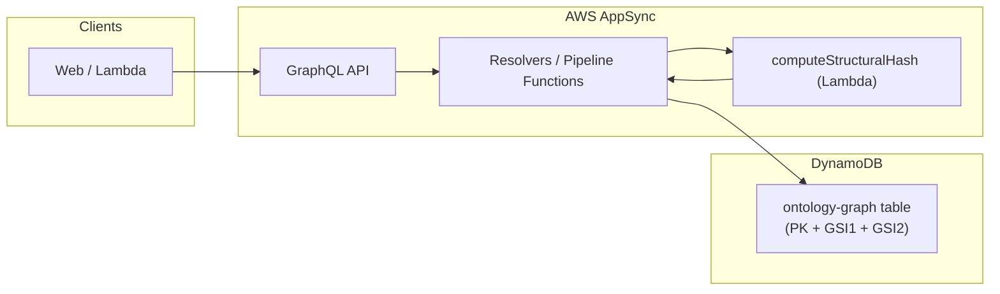

# Ontology GraphQL — architecture

This document describes the **current** end-to-end architecture of the ontology graph feature: how GraphQL operations map to DynamoDB, how resolvers behave, and how the pieces are wired in Terraform and the `@stratiqai/types-simple` package.

For a shorter feature summary and codegen notes, see [Step 2 - ontology-graph.md](./Step%202%20-%20ontology-graph.md). For manual AppSync console tests, see [appsync-console/README.md](./appsync-console/README.md) and [WALKTHROUGH.md](./appsync-console/WALKTHROUGH.md).

---

## 1. Purpose and scope

The ontology graph provides:

- **Entity definitions** — metamodel per project (JSON Schema, server-computed structural hash, normalized schema, property metadata).
- **Entity instances** — concrete graph nodes with dynamic property values and optional relationships to other instances.

It is intentionally **separate** from the platform's main DynamoDB single-table model and pipeline resolvers: ontology data lives in its own table and uses dedicated **APPSYNC_JS** unit and pipeline resolvers against that table only.

---

## 2. High-level flow

- **Schema source of truth (SDL):** `stratiqai-types-simple` — merged at deploy time into one string AppSync receives.
- **Resolver code:** `stratiqai-platform/backend/src/resolvers/ontology/*.js`.
- **Lambda code:** `stratiqai-platform/backend/src/handlers/computeStructuralHash/index.ts`.
- **Infrastructure:** `stratiqai-platform/modules/storage` (table), `modules/api` (datasources, IAM, resolvers/functions).

---

## 3. GraphQL schema layout

AppSync does **not** reliably support `extend type Query { ... }` for adding fields. Therefore:

| File | Contents |
|------|-----------|
| [`src/graphql/ontology-schema.graphql`](../../src/graphql/ontology-schema.graphql) | Enums, object types, inputs (`EntityDefinition`, `EntityInstance`, `SaveInstanceInput`, etc.). |
| [`src/graphql/schema.graphql`](../../src/graphql/schema.graphql) | Ontology **operation fields** inlined under `type Query`, `type Mutation`, and `type Subscription` (search for `# ONTOLOGY GRAPH`). |

Codegen may load an extra overlay file (e.g. `AWSDate`) that is **not** merged into the deployed AppSync schema; see `codegen.yml` in the types package.

---

## 4. GraphQL operations (current)

### Queries

| Field | Arguments | Returns |
|-------|-----------|---------|
| `listEntityDefinitions` | `projectId` | All definitions for the project (`DEF#` prefix on SK). |
| `getEntityDefinition` | `projectId`, `id` | Single definition by id. |
| `getEntityDefinitionByHash` | `projectId`, `structuralHash` | Single definition by structural hash via **GSI2**. |
| `getEntityInstance` | `projectId`, `id` | Single instance. |
| `listEntityInstances` | `projectId` | All instances for the project (`INST#` on SK). |
| `listEntityInstancesByDefinition` | `projectId`, `definitionId` | Instances for one definition via **GSI1**. |

### Mutations

| Field | Notes |
|-------|--------|
| `saveEntityDefinition` | **Pipeline** — see §7. Lambda computes `structuralHash` server-side; DynamoDB PutItem stores the full definition with GSI2 keys. |
| `deleteEntityDefinition` | `DeleteItem` — returns deleted attributes when present. |
| `saveEntityInstance` | **Pipeline** — see §8. Upsert with partial merge of `valuesMap`. |
| `deleteEntityInstance` | `DeleteItem`. |

### Subscriptions (`@aws_subscribe`)

All ontology subscriptions are **mutation-triggered**; AppSync matches subscription variables to fields on the mutation result.

| Subscription | Mutations | Filter semantics |
|--------------|-----------|------------------|
| `onDefinitionSaved` | `saveEntityDefinition` | `projectId` |
| `onDefinitionDeleted` | `deleteEntityDefinition` | `projectId` |
| `onInstanceUpdated` | `saveEntityInstance` | `projectId` **and** `id` (one instance) |
| `onProjectInstancesChanged` | `saveEntityInstance` | `projectId` only (all instance saves in project) |
| `onInstanceDeleted` | `deleteEntityInstance` | `projectId` |

---

## 5. DynamoDB physical model

**Table:** `{project}-{env}-ontology-graph` (`aws_dynamodb_table.ontology_graph`).

| Key / index | Attributes | Role |
|-------------|------------|------|
| **Primary** | `projectId` (HASH), `recordId` (RANGE) | Single-table partition per project. |
| **GSI1** | `GSI1PK`, `GSI1SK` | Query instances by definition within a project. |
| **GSI2** | `GSI2PK`, `GSI2SK` | Look up definitions by structural hash within a project. |

**Logical item types** (encoded in `recordId` and optional GSI keys):

| Kind | `projectId` (stored) | `recordId` (stored) | GSI keys | Other notable attributes |
|------|----------------------|---------------------|----------|---------------------------|
| Definition | `PROJ#<projectId>` | `DEF#<definitionId>` | `GSI2PK` = `PROJ#<projectId>`, `GSI2SK` = `HASH#<structuralHash>` | `name`, `description`, `jsonSchema`, `structuralHash`, `normalizedJsonSchema`, `properties`, `updatedAt` |
| Instance | `PROJ#<projectId>` | `INST#<instanceId>` | `GSI1PK` = `PROJ#<projectId>`, `GSI1SK` = `DEF#<definitionId>` | `definitionId` (plain id), `valuesMap`, `label`, `children`, `updatedAt`, `senderId`, … |

**Prefixes:**

- GraphQL `projectId` and `id` arguments are **without** `PROJ#` / `DEF#` / `INST#`.
- Resolvers translate to/from prefixed keys for DynamoDB.
- `definitionId` on instances is stored and returned as a **plain** id; `DEF#` is used only for `GSI1SK` (and response handlers strip `DEF#` if legacy data still has it).

**`valuesMap` vs GraphQL `values`:**

- DynamoDB stores instance properties as a **map** `valuesMap[propertyName] → { stringValue, numberValue, … }`.
- GraphQL exposes `values: [PropertyValue]`. Read paths and `saveEntityInstance` responses **expand** the map to a list; writes **merge** supplied properties into the map (see §8).

---

## 6. Resolver inventory

All resolver/function code: `stratiqai-platform/backend/src/resolvers/ontology/`.

| GraphQL field | Kind | Source file(s) |
|---------------|------|----------------|
| `listEntityDefinitions` | UNIT | `listEntityDefinitions.js` |
| `getEntityDefinition` | UNIT | `getEntityDefinition.js` |
| `getEntityDefinitionByHash` | UNIT | `getEntityDefinitionByHash.js` (Query on **GSI2**) |
| `getEntityInstance` | UNIT | `getEntityInstance.js` |
| `listEntityInstances` | UNIT | `listEntityInstances.js` |
| `listEntityInstancesByDefinition` | UNIT | `listEntityInstancesByDefinition.js` (Query on **GSI1**) |
| `saveEntityDefinition` | **PIPELINE** | `saveEntityDefinition.js` (before/after) + functions below |
| `deleteEntityDefinition` | UNIT | `deleteEntityDefinition.js` |
| `saveEntityInstance` | **PIPELINE** | `saveEntityInstance.js` (before/after) + functions below |
| `deleteEntityInstance` | UNIT | `deleteEntityInstance.js` |

**Pipeline functions:**

| Function name | Datasource | Source file |
|---------------|------------|------------|
| `computeStructuralHash` | Lambda (`compute_structural_hash_lambda`) | `computeStructuralHashFn.js` (APPSYNC_JS wrapper) + `backend/src/handlers/computeStructuralHash/index.ts` (Lambda) |
| `putEntityDefinition` | `ontology_table` | `putEntityDefinition.js` |
| `saveInstanceInit` | `ontology_table` | `saveInstanceInit.js` |
| `saveInstanceValues` | `ontology_table` | `saveInstanceValues.js` |

Terraform registers these in `modules/api/resolvers.tf` (ontology section). The DynamoDB datasource is `aws_appsync_datasource.ontology_table`; the Lambda datasource is `aws_appsync_datasource.compute_structural_hash_lambda`.

---

## 7. `saveEntityDefinition` pipeline (schema fingerprinting)

**Problem:** APPSYNC_JS has no `crypto.subtle` — it cannot compute SHA-256 hashes. The `structuralHash` field must be computed server-side so callers cannot forge or omit it.

**Approach:**

1. **Function `computeStructuralHash`** (Lambda) — the APPSYNC_JS wrapper (`computeStructuralHashFn.js`) forwards `ctx.args.input.jsonSchema` in the Lambda payload. Because `AWSJSON` scalars are **auto-deserialized** by AppSync, the value arrives at the Lambda as a JavaScript object, not a string. The Lambda normalises the input (`typeof` check → `JSON.stringify` if needed), then imports `SchemaFingerprint` from `@stratiqai/types-simple` to compute the SHA-256 hash. It returns `{ structuralHash, normalizedJsonSchema }` where `normalizedJsonSchema` is a **parsed object** (not a string) so that DynamoDB stores it as a Map and the `AWSJSON` scalar serialises it correctly without double-encoding. The wrapper stashes both values into `ctx.stash`.
2. **Function `putEntityDefinition`** (DynamoDB) — reads `ctx.stash.structuralHash` and `ctx.stash.normalizedJsonSchema`, builds a `PutItem` with all definition attributes including `GSI2PK = PROJ#<projectId>` and `GSI2SK = HASH#<structuralHash>`.
3. **Pipeline handler `saveEntityDefinition.js`** — `request` is a no-op; `response` reads `ctx.prev.result`, strips key prefixes, returns the definition.

**Input change:** `structuralHash` was **removed** from `SaveEntityDefinitionInput`. The field is output-only — always computed by the pipeline.

**AWSJSON round-trip:** Fields typed as `AWSJSON` (e.g. `jsonSchema`, `normalizedJsonSchema`) must be stored in DynamoDB as **Maps** (not Strings). If stored as a String, AppSync's AWSJSON serialiser wraps it in another layer of JSON encoding, producing double-escaped output. The Lambda returns `normalizedJsonSchema` as an object for this reason.

**GSI2 keys:** Every definition PutItem writes `GSI2PK` and `GSI2SK` so `getEntityDefinitionByHash` can look it up. When a definition's `jsonSchema` changes, the hash changes and the old GSI2 entry is replaced (PutItem overwrites the row).

---

## 8. `saveEntityInstance` pipeline (why two steps)

**Problem:** A single `UpdateItem` cannot combine `SET valuesMap = if_not_exists(valuesMap, {})` with `SET valuesMap.<key> = :v` in one expression — DynamoDB reports overlapping document paths.

**Approach:**

1. **Function `saveInstanceInit`** — `UpdateItem` sets core attributes (`GSI1PK`, `GSI1SK`, `definitionId`, `updatedAt`, `senderId`, optional `label`/`children`) and `valuesMap = if_not_exists(valuesMap, {})` with **no** nested `valuesMap.*` paths in the same expression.
2. **Function `saveInstanceValues`** — `UpdateItem` sets only `valuesMap.#prop_i = :val_i` for each property in the mutation input. If `values` is empty/absent, uses `runtime.earlyReturn` to skip this step.
3. **Pipeline handler `saveEntityInstance.js`** — `request` is a no-op; `response` reads `ctx.prev.result`, strips key prefixes, maps `valuesMap` → `values[]` for GraphQL and subscriptions.

**Semantics:** Clients may send a **subset** of properties on each save; unspecified keys in `valuesMap` are left unchanged.

---

## 9. APPSYNC_JS constraints

The JS runtime is restricted. Resolver code avoids:

- Regular expressions and regex-based `replace`.
- `++` / `--` (use `idx = idx + 1`).
- Object spread/rest where validation fails; prefer `Object.assign({}, a, b)` and explicit field copies.

If deploy validation fails with "The code contains one or more errors," simplify syntax along these lines. Additionally, calling `util.toJson()` inside a Lambda-invoke payload object can trigger validation failures — handle type coercion in the Lambda itself instead. The `computeStructuralHash` Lambda is **not** subject to these constraints — it runs full Node.js 22.

---

## 10. Typed operations package

In `@stratiqai/types-simple`:

- **Queries / fragments:** `src/graphql/queries/Ontology.ts` — includes `Q_GET_ENTITY_DEFINITION_BY_HASH`
- **Mutations:** `src/graphql/mutations/Ontology.ts`
- **Subscriptions:** `src/graphql/subscriptions/Ontology.ts`
- **Client-side helpers:** `src/utils/ontologyHelpers.ts` — `computeSchemaHash()`, `computeSchemaHashFromString()`, `computeSchemaFingerprint()` for preview/cache-key use (hash is always authoritative from the server)

Re-exported via the package's index. After SDL changes, run the package build/codegen workflow (see project conventions / Verdaccio).

---

## 11. Deployment wiring (summary)

- **Storage:** `modules/storage/main.tf` — table + GSI1 + GSI2 + streams/PITR.
- **Compute:** `environments/dev/lambda.tf` — `module "lambda_compute_structural_hash"` (Node.js 22 Lambda, `layer_arns = []`). **Must be built with `BUNDLE_MODE=bundle`** so esbuild inlines `@stratiqai/types-simple` into a single file — no Lambda layer provides the dependency at runtime.
- **API module:**
  - Ontology table ARN + Lambda ARN on AppSync IAM policies.
  - `ontology_table` datasource (DynamoDB) + `compute_structural_hash_lambda` datasource (Lambda).
  - Resolver/function resources as in §6.
- **Environment:** e.g. `environments/dev/main.tf` — `schema_content` joins `schema.graphql` and `ontology-schema.graphql`; passes ontology table name/ARN and Lambda ARN into the API module.

---

## 12. Known limitations (query model)

- **Pagination:** List queries do not expose `nextToken` in the current schema; large projects may need a follow-up design.
- **Cross-project hash lookup:** `getEntityDefinitionByHash` is scoped to a single project (`GSI2PK = PROJ#<pid>`). Looking up a definition by hash across all projects would require a different GSI design.

---

## 13. Related documentation

| Document | Topic |
|----------|--------|
| [Step 1 - SCHEMA_FINGERPRINTING.md](./Step%201%20-%20SCHEMA_FINGERPRINTING.md) | `SchemaFingerprint`, `SchemaNormalizer`, `ZodSchemaAdapter` utilities |
| [Step 2 - ontology-graph.md](./Step%202%20-%20ontology-graph.md) | Feature intro, codegen, fingerprinting pointer |
| [appsync-console/README.md](./appsync-console/README.md) | Console copy/paste tests |
| [appsync-console/WALKTHROUGH.md](./appsync-console/WALKTHROUGH.md) | Ordered walkthrough including subscriptions and hash lookup |
| Platform `DOCUMENTATION.md` / `docs-src/` | Wider platform conventions |
